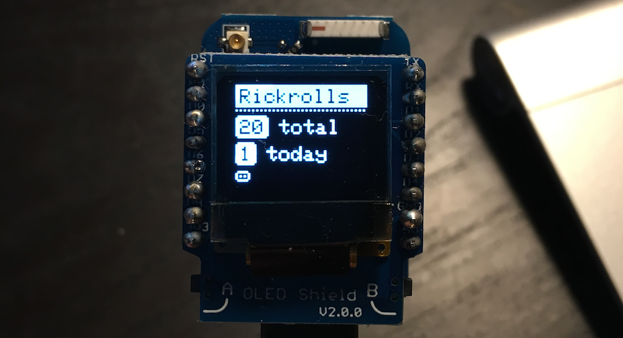

# ESP8266 Mobile Rick Roll Captive Portal

### Live Chat

The purpose of this project was to help @idolpx get familiar with programming for the ESP8266 and have a bit of fun.

* User connects to the device broadcasting an SSID of "FREE Highspeed WiFi" (this is configurable of course).
* The captive portal helper on their phone/table/computer kicks in and presents them with a page showing "Terms of Service" and a button labeled "I Accept".
* When they click the button a full screen animated GIF of Rick Astley dancing appears and an audio clip of "Never Gonna Give You Up" starts playing on loop.

### Forked project

This is a forked project originally made by @idolpx (https://github.com/idolpx), and you can see his project here: https://github.com/idolpx/mobile-rr.

Our projects differ a little bit:

- Inherited project use a piezo buzzer, I use an OLED screen (See attached pictures). The screen shows numbers of total rick rolls, current sessions rick rolls and a list of connected clients.
- Inherited project use websockets, interactive settings pages, and a console, I removed all that.

## Parts List
* ESP8266 Module (WeMos D1 Mini Pro) (http://hobbycomponents.com/development-boards/864-wemos-d1-mini-pro-esp8266-development-board).
* OLED-screen (WeMos D1 Mini OLED Shield) (http://hobbycomponents.com/shields/872-wemos-d1-mini-oled-shield).

Total cost: 15.99 GBP.

* (Optionally) a USB battery pack with micro-usb cable to power everything.
* (Optionally) an external antenna for a wider range.

## Build Firmware
I use PlatformIO to build this.  http://platformio.org/

* Install PlatformIO and let it update itself on first startup
* Once updated and restarted, clone the "mobile-rr" project to a folder and open the project in PlatformIO
* Next build the firmware by clicking the checkmark icon on the toolbar

## Upload Firmware and SPIFFS data
After your firmware build is successful you can upload it by clicking the arrow under the checkmark in the PlatformIO toolbar.

You can add/edit the files in the "www" folder to your liking. (Files in the "www" folder will be cloned and gzipped to the "data" folder when building.) Then follow the instructions below to build and upload the SPIFFS file system image to your ESP8266.

**Note: Anytime you make changes to the firmware or the data you can rebuild and upload either without the need to install the other again. They reside in different areas of the flash memory.**

## References
I learned everything I needed to create this from these projects

- PlatformIO - http://platformio.org/
- http://docs.platformio.org/en/latest/platforms/espressif.html#uploading-files-to-file-system-spiffs
- ESP8266 Captive Portal - https://www.hackster.io/rayburne/esp8266-captive-portal-5798ff
- ESP-RADIO - https://github.com/Edzelf/Esp-radio
- ESPAsyncWebServer - https://github.com/me-no-dev/ESPAsyncWebServer
- SOFTAP - Get List of Connected Clients - http://www.esp8266.com/viewtopic.php?f=32&t=5669
- How to print free memory - http://forum.wemos.cc/topic/175/how-to-print-free-memory
- WebSocketToSerial - https://github.com/hallard/WebSocketToSerial.git
- JQueryTerminal - https://github.com/jcubic/jquery.terminal
- OTA Update - http://www.penninkhof.com/2015/12/1610-over-the-air-esp8266-programming-using-platformio/
- Piezo Beep - http://framistats.com/2015/06/07/esp8266-arduino-smtp-server-part-2/
- Simple Audio Board - http://bitcows.com/?p=19
- Tone Doesn't Work - https://www.reddit.com/r/esp8266/comments/46kw38/esp8266_calling_tone_function_does_not_work/
- ArduinoJson - https://github.com/bblanchon/ArduinoJson
- EEPROM - https://gist.github.com/dogrocker/f998dde4dbac923c47c1
- Exception Causes - https://github.com/esp8266/Arduino/blob/master/doc/exception_causes.md
- WiFi Scan- https://www.linuxpinguin.de/project/wifiscanner/
- SPIFFS - https://github.com/esp8266/Arduino/blob/master/doc/filesystem.md
- http://blog.squix.org/2015/08/esp8266arduino-playing-around-with.html
- WiFiManager - https://github.com/tzapu/WiFiManager
- ESP-GDBStub - https://github.com/esp8266/Arduino/tree/master/libraries/GDBStub
